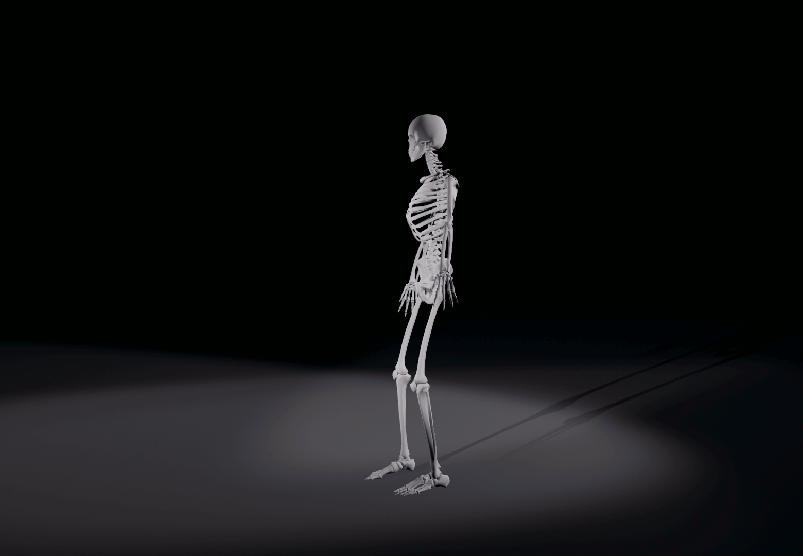
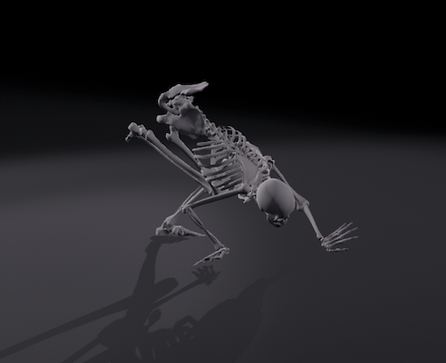

# [Manikin](https://manikin.app/)

模擬基本動作OK，但是複雜的動作例如瑜珈姿勢，則很難辦到。

## 單腳走路

這個軟體目前還不能寫指令腳本自動產生動作、動畫，因而必須手動調整每個動作，手動擷取每個畫面，再轉為動畫格式的gif檔案。

## Crow Pose

示範： [Livinleggings](https://youtu.be/PLbdPAA7sr4)

做了老半天，感覺上像一隻始祖鳥的化石。

## 對這個軟體的想像

在電腦上的模擬，如果能結合物理實體，會事半功倍。以此軟體為例，如果能結合一個實體骨架人偶，在骨架人偶中安裝感應器，讓人操作骨架人偶的時候，同步顯示在軟體畫面中，將會比使用滑鼠操作軟體中的骨架人偶更為便利。
