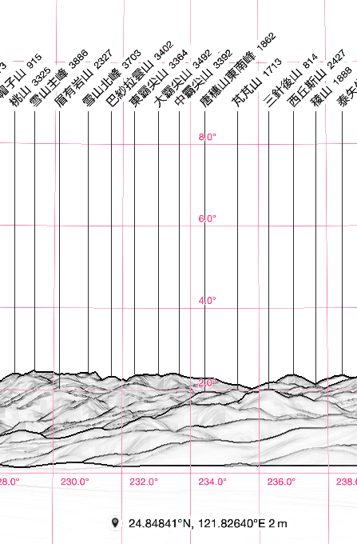
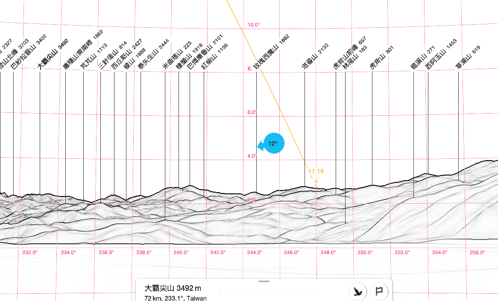
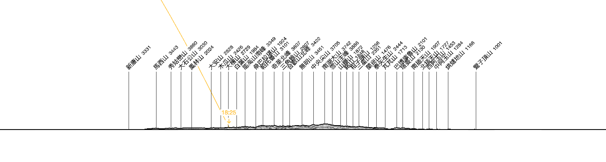
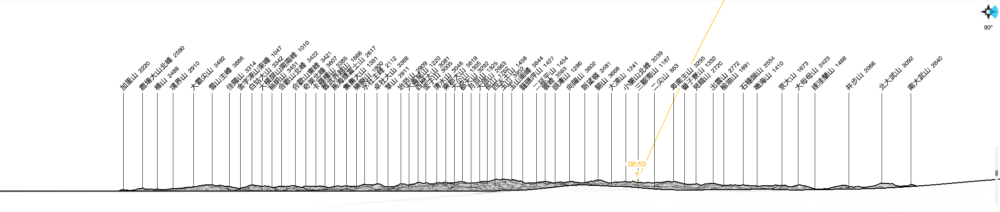
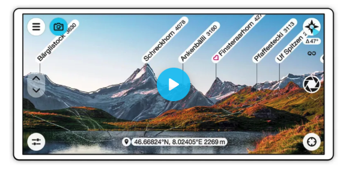

# [Web](https://www.peakfinder.org/)

## 從目前位置查找某座山頭的方向

- 方法一：啟用座標網格（ 設定 Settings -> 座標網格 Grid ），就會顯示某座山頭位於羅盤方位幾度

    大霸尖山在羅盤方向233度。

- 方法二：從選單 "可見山峰 Visible Peaks"，選擇一座山頭，畫面就會顯示需要轉動幾度才看得到那座山

    左轉12度才看得到大霸尖山。

## 地圖上的任意門

飛越到地圖上的任意地點，模擬該地點的視角，環視360度山際線。

- 從與那國島看台灣

- 從澎湖看台灣

# [App](https://www.peakfinder.org/mobile/)

## AR擴增實境山頭辨識

- 如果白描的山際線未與實際的影像重合，則拖曳山際線以與實際的影像重合。
- [以畫八字的方式校正羅盤](https://www.peakfinder.org/mobile/compass/)

## 改變視角

啟用座標網格（ 設定 Settings -> 座標網格 Grid ）可以輔助了解目前的視角。

- 左右拖曳改變羅盤方位角
- 上下拖曳改變俯仰角度
- [上下按鈕改變海拔高度](https://www.peakfinder.org/mobile/elevationoffset/)
- 切換到地圖上任意位置

    選單"視點選擇 Viewpoint selection -> 地圖"

- [飛越到指定山頭](https://www.peakfinder.org/mobile/peakname/)
