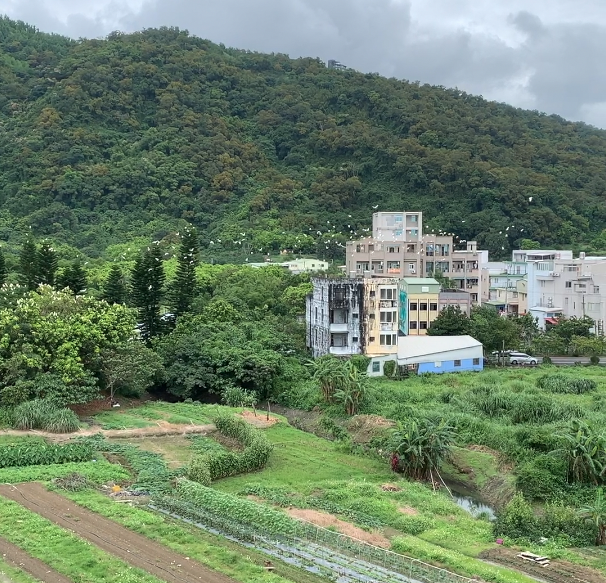
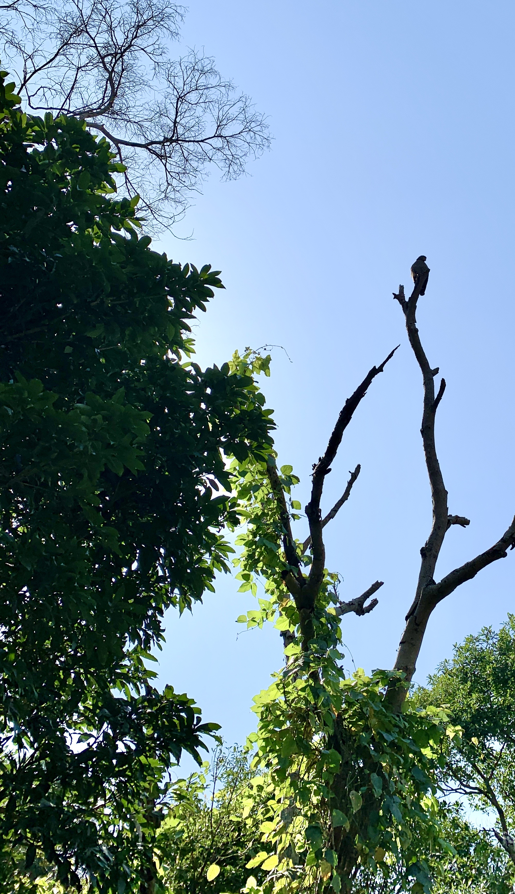
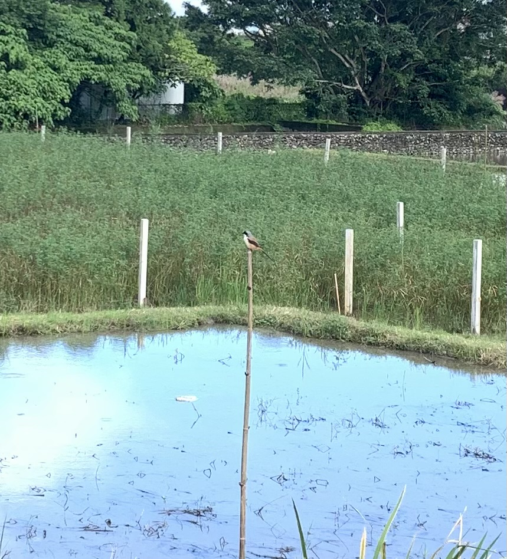

{{ "<iframe width=\"420\" height=\"315\" src=\"http://www.youtube.com/embed/dQw4w9WgXcQ\" frameborder=\"0\" allowfullscreen=\"allowfullscreen\"></iframe>" }}

## 紅冠水雞

## 鷺鷥

<iframe width="560" height="315" src="https://www.youtube.com/embed/boSe-z7Cteg" title="YouTube video player" frameborder="0" allow="autoplay; encrypted-media" allowfullscreen="allowfullscreen"></iframe> 



[鷺鷥](https://youtu.be/boSe-z7Cteg)

## 鷹

## 烏秋

## 燕

## 伯勞

